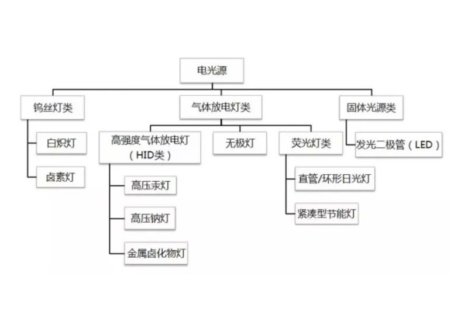

# 光色原理

## 显色指数/显色性

显色指数：color rendering index (CRI) 
光源对物体的显色能力称为显色性，是通过与同色温的参考或基准光源(白炽灯或画光)下物体外观颜色的比较。光所发射的光谱内容决定光源的光色，但同样光色可由许多，少数甚至仅仅两个单色的光波纵使而成，对各个颜色的显色性亦大不相同。相同光色的光源会有相异的光谱组成，光谱组成较广的光源较有可能提供较佳的显色品质。  
当光源光谱中很少或缺乏物体在基准光源下所反射的主波时，会使颜色产生明显的色差(color shift)。色差程度愈大，光源对该色的显色性愈差。显色指数系数(Kau fman)仍为定义光源显色性评价的普遍方法。  
太阳光的显色指数定义为100，白炽灯的显色指数非常接近日光，因此被视为理想的基准光源。  

显色指数及应用场景  

|指数(Ra)|等级|显色性|一般应用|
|---|---|---|---|
|90—100|1A|优良|需要色彩精确对比的场所|
|80—89|1B|/|需要色彩正确判断的场所|
|60—79|2|普通|需要中等显色性的场所|
|40—59|3|/|对显色性的要求较低，色差较小的场所|
|20—39|4|较差|对显色性没有具体要求的场所|

白炽灯的理论显色指数为100，但实际生活中的白炽灯种类繁多，应用也不同，所以其Ra值不是完全一致的，只能说是接近100，是显色性最好的灯具。具体灯具的显色指数值可见下表所举。

|光源|指数(Ra)|
|---|---|
|白炽灯 |97|
|日光色荧光灯 |80—94|
|白色荧光灯 |75—85|
|暖白色荧光灯 |80—90|
|卤钨灯 |95—99|
|高压汞灯 |22—51|
|高压钠灯 |20—30|
|金属卤化物灯 |60—65|
|钠铊铟灯 |60—65|
|镝灯 |85以上|

* 忠实显色:能正确表现物质本来的颜色需使用显色指数（Ra）高的光源，其数值接近100，显色性最好。
* 效果显色:要鲜明地强调特定色彩，表现美的生活可以利用加色的方法来加强显色效果。采用低色温光源照射，能使红色更加鲜艳；采用中等色温光源照射，使蓝色具有清凉感；采用高色温光源照射，使物体有冷的感觉。

常见电光源

## 光通量/流明(lm)

光通量（luminous flux）指人眼所能感觉到的辐射功率，它等于单位时间内某一波段的辐射能量和该波段的相对视见率的乘积。  
一只40W的日光灯输出的光通量大约是2100流明

## 色域

色域是对一种颜色进行编码的方法，也指一个技术系统能够产生的颜色的总和。在计算机图形处理中，色域是颜色的某个完全的子集。颜色子集最常见的应用是用来精确地代表一种给定的情况。例如一个给定的色彩空间或是某个输出装置的呈色范围。  
  
里面的那个三角越大越好 表示这个系统可以生成的颜色越丰富。而三角形的顶点往往是RGB。

## 色温

色温是表示光线中包含颜色成分的一个计量单位。从理论上说，黑体温度指绝对黑体从绝对零度（－273℃）开始加温后所呈现的颜色。黑体在受热后，逐渐由黑变红，转黄，发白，最后发出蓝色光。当加热到一定的温度，黑体发出的光所含的光谱成分，就称为这一温度下的色温，计量单位为“K”（开尔文）。  
如果某一光源发出的光，与某一温度下黑体发出的光所含的光谱成分相同，就称为某K色温。如100W灯泡发出的光的颜色，与绝对黑体在2527℃时的颜色相同，那么这只灯泡发出的光的色温就是：（2527+273）K=2800K。  
黑-->红-->橙-->黄-->白-->蓝  
使用这种方法标定的色温与普通大众所认为的“暖”和“冷”正好相反，例如，通常人们会感觉红色．橙色和黄色较暖，白色和蓝色较冷，而实际上红色的色温最低，然后逐步增加的是橙色、黄色、白色和蓝色，蓝色是最高的色温。  
利用自然光拍摄时，由于不同时间段光线的色温并不相同，因此拍摄出来的照片色彩也并不相同。例如，在晴朗的蓝天下拍摄时，由于光线的色温较高，因此照片偏冷色调；而如果在黄昏时拍摄时，由于光线的色温较低，因此照片偏暖色调。  

## 色相

颜色测量术语，颜色的属性之一，借以用名称来区别红、黄、绿、蓝等各种颜色。  
事实上任何黑白灰以外的颜色都有色相的属性，而色相也就是由原色、间色和复色来构成的。  
最初的基本色相为：红、橙、黄、绿、蓝、紫。在各色中间加插一两个中间色，其头尾色相，按光谱顺序为：红、橙红、黄橙、黄、黄绿、绿、绿蓝、蓝绿、蓝、蓝紫，紫。红紫、红和紫中再加个中间色，可制出十二基本色相。

## 彩度/饱和度/纯度

饱和度表示色相中灰色分量所占的比例，它使用从0%（灰色）至100%（完全饱和）的百分比来度量。

## 明度/亮度

亮度是颜色的相对明暗程度，通常使用从 0%（黑色）至 100%（白色）的百分比来度量。

## 色彩三要素

色相、饱和度、亮度是色彩三要素

  
HSB 颜色模型   
A. 色相 B. 饱和度 C. 亮度 

