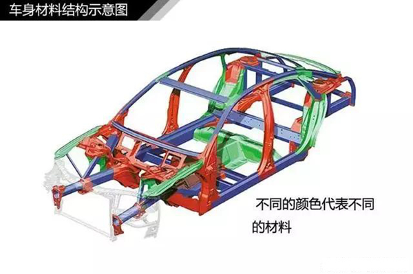
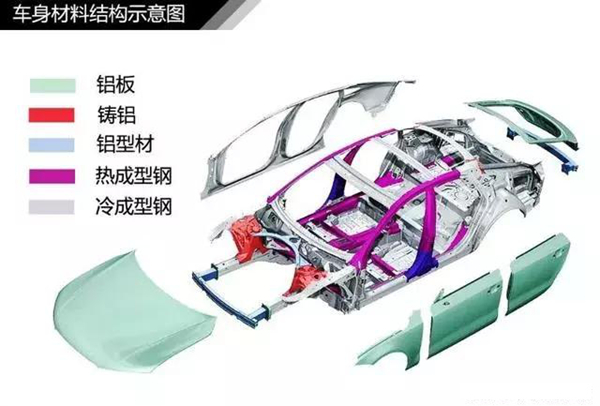
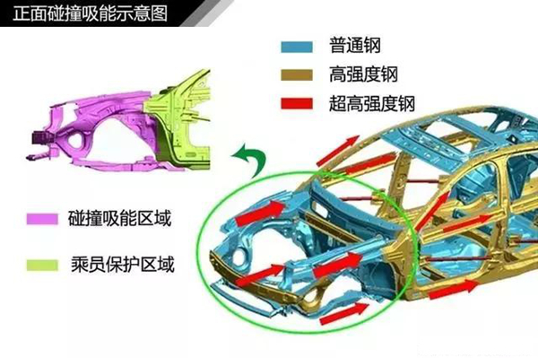

# 汽车知识学习--材料和溃缩吸能

* 车身材料：并不是车身所有的材料强度越高越好，要看用在什么地方。如驾乘室的框架(如横梁、纵梁、ABC柱等)，为了使驾车室的空间尽量不变形(保证驾乘人员安全)，就必须采用高强度的材料。

* 溃缩吸能： 在汽车碰撞中，重要的是保护车内人员的安全，所以在碰撞中驾乘室的变形越小就越好。汽车在设计时考虑到这一点，在汽车碰撞时，让一部分机构先溃缩，吸收一部分的撞击能量，从而减少传递到驾乘室的撞击力。

