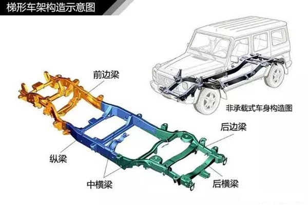
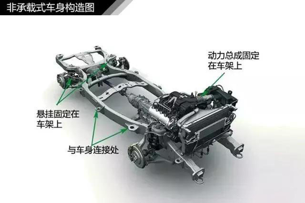
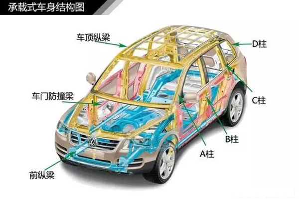

# 汽车知识学习--车体结构

* 非承载式车身：但凡那些敢称自己是硬派越野车的汽车，一般采用的都是非承载式车身结构，所谓非承载式车身，其发动机、传动系统、车身的总成部分是固定在一个刚性车架上，车架通过前后悬挂装置与车轮相连。
	* 非承载式车身有根大梁贯穿整个车身结构，底盘的强度较高，抗颠簸性能好。就算车的四个车轮受力不均匀，也是由车架承受，不会传递到车身，所以车身不容易扭曲变形。
	* 因为非承载式车身比较笨重、质量大、高度高，所以多用于货车、客车和越野车上。
	
	
	

* 承载式车身：承载式车身汽车的整个车身是为一体的，没有贯穿整体的大梁，发动机、传动系统、前后悬挂等部件都装配到车身上，车身负载通过悬挂装置传给车轮。
	* 承载式车身的汽车平直路上行驶很平稳、固有频率低、噪声小、重量轻，广泛应用于轿车上。
	* 当然底盘的强度是不及有大梁结构的非承载式车身，在车的四个车轮受力不均匀时，车身会发生变形。

	
	