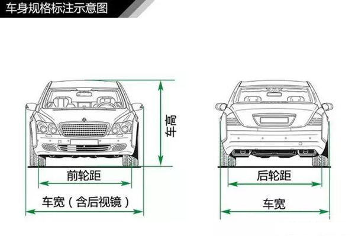
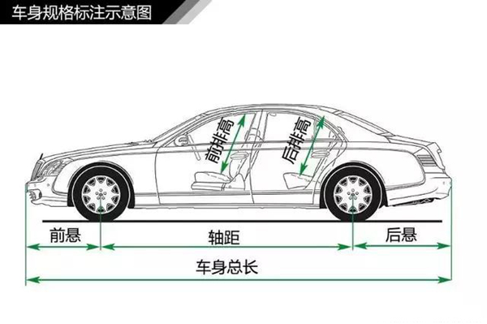
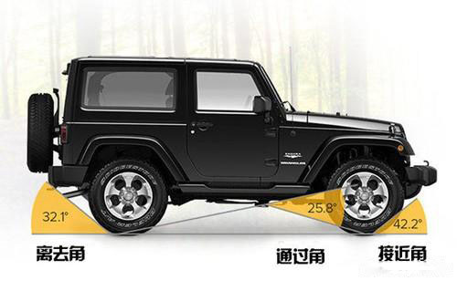
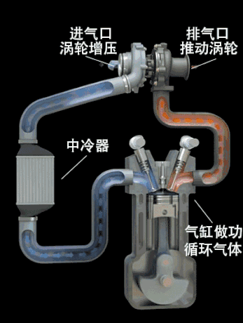

# 汽车知识学习

[汽车基础知识大全](https://baijiahao.baidu.com/s?id=1612000407171028767&wfr=spider&for=pc)

## 汽车基础知识

### 术语
* 轴距(mm)：汽车前轴中心至后轴中心的距离。
* 轮距(mm)：同一车轿左右轮胎胎面中心线间的距离。
* 转弯半径(mm)：汽车转向时，汽车外侧转向轮的中心平面在车辆支撑平面上的轨迹圆半径。转向盘转到极限位置时的转弯半径为最小转弯半径。
* 车轮数和驱动轮数(n×m)：车轮数以轮毂数为计量依据，n代表汽车的车轮总数，m代表驱动轮数。
* 最小离地间隙(mm)：汽车满载时，最低点至地面的距离。
* 前悬(mm)：汽车最前端至前轴中心的距离。
* 后悬(mm)：汽车最后端至后轴中心的距离。
* 离去角(°)：汽车后端突出点向后轮引的切线与地面的夹角。
* 接近角(°)：汽车前端突出点向前轮引的切线与地面的夹角。
* 最大爬坡度(%)：汽车满载时的最大爬坡能力。
* 最高车速(km/h)：汽车在平直道路上行驶时能达到的最大速度。
* 最大总质量(kg)：满载时总质量
* 最大装载质量(kg)：汽车在道路上行驶时的最大装载质量。
* 整车装备质量(kg)：汽车完全装备好的质量，包括润滑油、燃料、 随车工具、备胎等所有装置的质量。
* 最大轴载质量(kg)：汽车单轴所承载的最大总质量。与道路通过性有关。

### 专业术语
* 压缩比：压缩比是指气缸总容积与燃烧室容积的比值，它表示活塞从下止点移到上止点时气缸内气体被压缩的程度。
	* 一般地说，发动机的压缩比愈大；在压缩行程结束时混合气的压力和温度就愈高，燃烧速度也愈快，因而发动机的功率愈大，经济性愈好。
	* 但压缩比过大时，不仅不能进一步改善燃烧情况，反而会出现爆燃、表面点火等不正常燃烧现象，又反过来影响发动机的性能。
	* 此外，发动机压缩比的提高还受到排气污染法规的限制。
* 功率：功率是指物体在单位时间内所做的功。在一定的转速范围内，汽车发动机的功率与发动机转速成非线性正比关系，转速越快功率越大，反之越小，它反映了汽车在一定时间内的作功能力。
	* 一般在说明发动机最高输出功率的同时标出每分钟转速(r/min)，如100PS／5000r／min，即在每分钟5000转时最高输出功率为100马力(73.5kW)。
	* 常用最大功率来描述汽车的动力性能。最大功率一般用马力(PS)或千瓦(kW)来表示，1马力等于0.735千瓦。
* 排量：发动机排量是各缸工作容积的总和，一般用毫升(CC)来表示。
	* 气缸工作容积是指活塞从上止点到下止点所扫过的气体容积，又称为单缸排量，它取决于缸径和活塞行程。
	* 排量是最重要的结构参数之一，它比缸径和缸数更能代表发动机的大小，发动机的许多指标都同排量密切相关。
* 扭矩：扭矩是使物体发生转动的力。发动机的扭矩就是指发动机从曲轴端输出的力矩。它反映了汽车在一定范围内的负载能力。
	* 在功率固定的条件下它与发动机转速成反比关系，转速越快扭矩越小，反之越大。
	* 启动时或在山区行驶时，扭矩越高汽车运行的反应便越好。
	* 发动机的扭矩的表示方法是牛米(N.m)。
	* 一般在说明发动机最大输出扭矩的同时也标出每分钟转速(r／min)。
	* 最大扭矩一般出现在发动机的中、低转速的范围。
* 空气阻力系数(CD)：汽车在行驶中由于空气阻力的作用，围绕着汽车重心同时产生纵向、侧向和垂直等三个方向的空气动力量，其中纵向空气力量是最大的空气阻力，大约占整体空气阻力的80%以上。空气阻力系数值是由风洞测试得出来的。
	* 在汽车行驶范围内，空气阻力的数值通常都与气流相对速度的动压力1/2 ρur^2成正比例。Fw=1/2 C_D Aρu_r^2，式中，C_D为空气阻力系数。
		* ρ为空气密度，一般ρ=1.2258N∙s^2∙m^(-4)；A为迎风面积，即汽车行驶方向的投影面积（m^2）；ur为相对速度，在无风时即汽车的行驶速度（m/s）
	* 由于空气阻力与空气阻力系数成正比关系，现代轿车为了减少空气阻力就必须要考虑降低空气阻力系数。
	* 从20世纪50年代到70年代初，轿车的空气阻力系数维持在0.4至0.6之间。
	* 70年代能源危机后，各国为了进一步节约能源，降低油耗，都致力于降低空气阻力系数。
	* 现在轿车的空气阻力系数一般在0.28至0.4之间。
	* 试验表明，空气阻力系数每降低10%，燃油节省7%左右。
* 传动系：传动系由离合器、变速器、万向传动装置和驱动桥组成，用来将发动机输出的动力传给驱动轮，并使之适合与汽车行驶的需要。

### 常见汽车车型
* SUV：SportUtilityVehicle，运动型多用途汽车。
* MPV：Multi-PurposeVehicle，多用途汽车。
* RV：Recreati&aVehicle，即休闲车，是一种适用于娱乐、休闲、旅行的汽车，首先提出RV汽车概念的国家是日本。
* CKD：CompletelyKnockedDown，意思是"完全拆散"。换句话说，CKD汽车就是进口或引进汽车时，汽车以完全拆散的状态进入，之后再把汽车的全部零、部件组装成整车。
* SKD：Semi-KnockedDown，意思是"半散装"。换句话说，SKD汽车就是指从国外进口汽车总成(如发动机、驾驶室、底盘等)，然后在国内汽车厂装配而成的汽车。
* PICK-UP：皮卡。
* ConceptionCar：概念车。
* 老爷车：也叫古典车，一般指20年前或更老的汽车。老爷车是一种怀旧的产物，是人们过去曾经使用的，现在仍可以工作的汽车。

### 汽车特点分类
* 电动汽车：纯电动
* 零排放汽车：指不排出任何有害污染物的汽车，比如太阳能汽车、纯电动汽车、氢气汽车等。有时人们也把零排放汽车称为绿色汽车、环保汽车、生态汽车、清洁汽车等。
* 混合动力汽车：就是在纯电动汽车上加装一套内燃机，其目的是减少汽车的污染，提高纯电动汽车的行驶里程。混合动力汽车有串联式和并联式两种结构形式。
* 燃油汽车：
* 燃气汽车：燃气汽车主要有液化石油气汽车(.简称LPG汽车或LPGV)和压缩天然气汽车(简称CNG汽车或CNGV)。顾名思义，LPG汽车是以液化石油气为燃料，CNG汽车是以压缩天然气为燃料。燃气汽车的CO排放量比汽油车减少90%以上，碳氢化合物排放减少70%以上，氮氧化合物排放减少35%以上，是目前较为实用的低排放汽车。

### 发动机
* 汽车发动机常用缸数有3、4、5、6、8、10、l2缸。排量1L以下的发动机常用3缸；(1-2.5)L一般为4缸发动机；3L左右的发动机一般为6缸；4L左右为8缸；5.5L以上用12缸发动机。
* 在同等缸径下，缸数越多，排量越大，功率越高；在同等排量下，缸数越多，缸径越小，转速可以提高，从而获得较大的提升功率。
* 气缸的排列形式主要有L直列、V形、H水平对置、W（w12/16）形等
	* 直列发动机的气缸体成一字排开，缸体、缸盖和曲轴结构简单，制造成本低，低速扭矩特性好，燃料消耗少，应用比较广泛，缺点是功率较低。
		* 一般1L以下的汽油机多采用3缸直列，(1-2.5)L汽油机多采用直列4缸，有的四轮驱动汽车采用直列6缸，因为其宽度小，可以在旁边布置增压器等设施。
		* 直列6缸的动平衡较好，振动相对较小，所以也为一些中、高极轿车采用。
	* V形发动机长度和高度尺寸小，布置起来非常方便，而且一般认为，V形发动机是比较高级的发动机，也成为轿车级别的标志之一。
		* V8发动机结构非常复杂，制造成本很高，所以使用得较少。
		* V12，发动机过大过重，只有极个别的高级轿车采用。
	* W型发动机是德国大众专属发动机技术。
		* W型与V型发动机相比可以将发动机做得更短一些，曲轴也可短些，这样就能节省发动机所占的空间，同时重量也可轻些。
		* 但它的宽度更大，使得发动机室更满。
* 一般5缸以下发动机的气缸多采用直列方式排列，少数6缸发动机也有直列方式的，过去也有过直列8缸发动机。
* (6-12)缸发动机一般采用V形排列，其中VIO发动机主要装在赛车上。
* 目前最常见的发动机主要是直列4缸(14)与V型6缸(V6)发动机。

`注`：由于近年来节能环保的普遍呼声，以及发动机技术的不断进步，特别是随着发动机新的电控技术的迅速发展，汽车发动机排量也日趋下降。小排量、涡轮增压、多气门、可变气门、可变进气歧管、缸内燃油直喷等技术已经成为了未来发动机发展的典型技术特征。

### 发动机的细节
* 电喷装置：发动机的电喷装置一般是由喷油油路、传感器组和电子控制单元三大部分组成的。
	* 单点电喷：喷射器安装在原来化油器位置上，即整个发动机只有一个汽油喷射点。
	* 多点电喷：喷射器安装在每个气缸的进气管上，即至少每个气缸都有一个喷射点。
	* 缸内直喷：在多点电喷的基础上，直接在气缸内喷油，它对于喷油时间及量的控制又达到了一个新的高度。
		* 自然对于发动机的动力，燃油经济性又有了进一步的提升。
		* 它也成为了未来发展的核心趋势，各大厂商也都在这个基础上进行了相应的调整以更好地提升发动机效率，例如通用小排量发动机研发的中置直喷技术等等。
* 闭环控制：发动机电喷系统的闭环控制是一个实时的氧传感器、计算机和燃油量控制装置三者之间闭合的三角关系。
	* 氧传感器"告诉"计算机混合气的空燃比情况，计算机发出命令给燃油量控制装置，向理论值的方向调整空燃比(14.7：1)。这一调整经常会超过一点理论值，氧传感器察觉出来，并报告计算机，计算机再发出命令调回到14.7：1。因为每一个调整的循环都很快，所以空燃比不会偏离14.7：1，一旦运行，这种闭环调整就连续不断。
	* 采用闭环控制的电喷发动机，由于能使发动机始终在较理想的工况下运行(空燃比偏离理论值不会太多)，从而能保证汽车不仅具有较好的动力性能，还能省油。
* 凸轮轴：凸轮轴是活塞发动机里的一个部件。它的作用是控制气门的开启和闭合动作。它在运行过程中承受很大的扭矩，因此设计中对凸轮轴在强度和支撑方面的要求很高，其材质一般是优质合金钢或合金钢。由于气门运动规律关系到一台发动机的动力和运转特性，因此凸轮轴设计在发动机的设计过程中占据着十分重要的地位。
	* 凸轮轴安装位置有下置、中置、顶置三种形式。
	* 现代轿车发动机一般都采用了顶置式凸轮轴。
* 多气门：
	* 传统的发动机多是每缸一个进气门和一个排气门；
	* 新款轿车大都采用四气门技术：每个气缸各有两个进气门和两个排气门。

### 变速器
* 自动变速器：自动变速器具有操作容易、驾驶舒适、能减少驾驶者疲劳的优点，已成为现代轿车配置的一种发展方向。
	* 装有自动变速器的汽车能根据路面状况自动变速变矩。
	* 汽车自动变速器常见型式：分别是手动变速器（MT）、液力自动变速器(AT)、机械无级自动变速器(CVT)、电控机械自动变速器(AMT)
		* 目前轿车普遍使用的是AT，AT几乎成为自动变速器的代名词。
			* AT是由液力变扭器、行星齿轮和液压操纵系统组成，通过液力传递和齿轮组合的方式来达到变速变矩。
			* 其中液力变扭器是最重要的部件，它由泵轮、涡轮和导轮等构件组成，兼有传递扭矩和离合的作用。
			* 一般来说，自动变速器的挡位分为P、R、N、D、2、1或L等。
				* P(Parking)：用作停车之用，它是利用机械装置去锁紧汽车的转动部分，使汽车不能移动。
					* 要注意的是：车辆一定要在完全停止时才可使用P挡，要不然自动变速器的机械部分会受到损坏。
					* 另外，自动变速轿车上装置空挡启动开关，使得汽车只能在"P"或"N"挡才能启动发动机，以避免在其他挡位上误启动时使汽车突然前窜。
				* R(Reverse)：倒挡，车辆倒后之用。
					* 通常要按下拨杆上的保险按钮，才可将拨杆移至"R"挡。
					* 要注意的是：当车辆尚未完全停定时，绝对不可以强行转至"R"挡，否则变速器会受到严重损坏。
				* N(Neutral)：空挡。将拨杆置于"N"挡上，发动机与变速器之间的动力已经切断分离。
					* 如短暂停留可将拨杆置于此挡并拉出手制动杆，右脚可移离刹车踏板稍作休息。
				* D(Drive)：前进挡，用在一般道路行驶。
					* 所以"D"挡一般包括从1挡至高挡或者2挡至高挡，并会因车速及负荷的变化而自动换挡。
				* 2(SecondGear)：2挡为前进挡，但变速器只能在1挡、2挡之间变换。
					* 将拨杆放置在2挡位，汽车会由1挡起步，当速度增加时会自动转2挡。
					* 2挡可以用作上、下斜坡之用，此挡段的好处是当上斜或落斜时，车辆会稳定地保持在1挡或2挡位置。
					* 不会因上斜的负荷或车速的不平衡、令变速器不停地转挡。
					* 在落斜坡时，利用发动机低转速的阻力作制动，也不会令车子越行越快。
				* 1(FirstCear)：1挡也是前进挡，但变速器只能在1挡内工作，不能变换到其他挡位。
					* 它用在严重交通堵塞的情况和斜度较大的斜坡上最能发挥功用。
					* 上斜坡或下斜坡时，可充分利用汽车发动机的扭力。
		* 手动/自动一体式变速器：是在自动变速器的基础上配以手动换挡功能而成。装有手动／自动一体式变速器的汽车在任何时刻都可以进行自动换挡与手动换挡的切换。
		* 

### 悬架
* 悬架是汽车的车架与车桥或车轮之间的一切传力连接装置的总称。其作用是传递作用在车轮和车架之间的力和力扭，并且缓冲由不平路面传给车架或车身的冲击力，并衰减由此引起的震动，以保证汽车能平顺地行驶。典型的悬架结构由弹性元件、导向机构以及减震器等组成，个别结构则还有缓冲块、横向稳定杆等。弹性元件又有钢板弹簧、空气弹簧、螺旋弹簧以及扭杆弹簧等形式，而现代轿车悬架多采用螺旋弹簧和扭杆弹簧，个别高级轿车则使用空气弹簧。
* 悬架是汽车中的一个重要总成，它把车架与车轮弹性地联系起来，关系到汽车的多种使用性能。从外表上看，轿车悬架仅是由一些杆、筒以及弹簧组成，但千万不要以为它很简单，相反轿车悬架是一个较难达到完美要求的汽车总成，这是因为悬架既要满足汽车的舒适性要求，又要满足其操纵稳定性的要求，而这两方面又是互相对立的。

### 一些装置
* 三元催化器：是安装在汽车排气系统中最重要的机外净化装置，它可将汽车尾气排出的CO、HC和NOx等有害气体通过氧化和还原作用转变为无害的二氧化碳、水和氮气。
	* 由于这种催化器可同时将废气中的工种主要有害物质转化为无害物质，故称三元。
	* 三元催化器的工作原理是：当高温的汽车尾气通过净化装置时，三元催化器中的净化剂将增强CO、HC和NOx三种气体的活性，促使其进行一定的氧化-还原化学反应。
		* 其中CO在高温下氧化成为无色、无毒的二氧化碳气体；
		* HC化合物在高温下氧化成水(H20)和二氧化碳；
		* NOx还原成氮气和氧气。
* 涡轮增压(Turbo)：轿车尾部看到Turbo或者T，即表明该车采用的发动机是涡轮增压发动机。涡轮增压器实际上是种空气压缩机，通过压缩空气来增加进气量。
	* 它利用发动机排出的废气惯性冲力来推动涡轮室内的涡轮，涡轮又带动同轴的叶轮，叶轮压送由空气滤清器管道送来的空气，使之增压进入气缸。
	* 当发动机转速增快，废气排出速度与祸轮转速也同步增快，叶轮就压缩更多的空气进入气缸，空气的压力和密度增大可以燃烧更多的燃料，相应增加燃料量就可以增加发动机的输出功率。
	* 涡轮增压器的最大优点是能在不加大发动机排量就能较大幅度地提高发动机的功率及扭力。
	* 一般而言，加装增压器后的发动机的功率及扭矩要增大20%-30%。
	* 涡轮增压器的缺点是滞后，即由于叶轮的惯性作用对油门骤时变化反应迟缓，使发动机延迟增加或减少输出功率，这对于要突然加速或超车的汽车而言，瞬间会有点提不上劲的感觉。

	
	
* 发动机防盗锁止系统：由于汽车门锁具有一定的互开率，降低了汽车的防盗功能，因此人们开发了发动机防盗锁止系统。对于已装有发动机防盗锁止系统的轿车；即使盗车贼能打开车门也无法开走轿车。
	* 典型的发动机防盗锁止系统是这样工作的：汽车点火钥匙中内装有电子芯片，每个芯片内都装有固定的ID(相当于身份识别号码)，只有钥匙芯片的ID与发动机一侧的ID一致时，汽车才能启动，相反，如果不一致，汽车就会马上自动切断电路，使发动机无法启动。
* 汽车导航系统(CIPS)：
* 盘式制动器：又称为碟式制动器。它由液压控制，主要零部件有制动盘、分泵、制动钳、油管等。
	* 制动盘用合金钢制造并固定在车轮上。
	* 分泵固定在制动器的底板上固定不动。
	* 制动钳上的两个摩擦片分别装在制动盘的两侧。
	* 分泵的活塞受油管输送来的液压作用，推动摩擦片压向制动盘发生摩擦制动，动作起来就好像用钳子钳住旋转中的盘子，迫使它停下来。
	* 盘式制动器散热快、重量轻、构造简单、调整方便。
	* 特别是高负载时耐高温性能好，制动效果稳定，而且不怕泥水侵袭，在冬季和恶劣路况下行车，盘式制动比鼓式制动更容易在较短的时间内令车停下。
	* 有些盘式制动器的制动盘上还开了许多小孔，以加速通风散热和提高制动效率。
* 防抱死制动系统(ABS)：Anti-lockBrakingSystem缩写。
	* 刹车一脚到底，车轮容易发生抱死不转动，从而使汽车发生危险工况，前轮抱死引起汽车失去转弯能力，后轮抱死容易发生甩尾事故等等。
	* ABS是通过安装在各车轮或传动轴上的转速传感器等不断检铡各车轮的转速，由计算机计算出当时的车轮滑移率(由滑移率拢了解汽车车轮是否已抱死)，并与理想的滑移率相比较，做出增大或减小制动器制动压力的决定，命令执行机构及时调整制动压力，以保持车轮处于理想的制动状态。因此，ABS装置能够使车轮始终维持在有微弱滑移的滚动状态下制动，而不会抱死，达到提高制动效能的目的。
* 电子制动力分配系统(EBD)：EBD能够根据由于汽车制动时产生轴荷转移的不同，而自动调节前、后轴的制动力分配比例，提高制动效能，并配合ABS提高制动稳定性。
	* 汽车在制动时，四只轮胎附着的地面条件往往不一样。比如，有时左前轮和右后轮附着在干燥的水泥地面上，而右前轮和左后轮却附着在水中或泥水中，这种情况会导致在汽车制动时四只轮子与地面的摩擦力不一样，制动时容易造成打滑、倾斜和车辆侧翻事故。
	* EBD用高速计算机在汽车制动的瞬间，分别对四只轮胎附着的不同地面进行感应、计算，得出不同的摩擦力数值，使四只轮胎的制动装置根据不同的情况用不同的方式和力量制动，并在运动中不断高速调整，从而保证车辆的平稳、安全。
* 牵引力控制系统(TCS)：又称循迹控制系统。汽车在光滑路面制动时，车轮会打滑，甚至使方向失控。同样，汽车在起步或急加速时，驱动轮也有可能打滑，在冰雪等光滑路面上还会使方向失控而出危险。TCS就是针对此问题而设计的。
	* TCS依靠电子传感器探测到从动轮速度低于驱动轮时(这是打滑的特征)，就会发出一个信号，调节点火时间、减小气门开度、减小油门、降挡或制动车轮，从而使车轮不再打滑。
	* TCS可以提高汽车行驶稳定性，提高加速性，提高爬坡能力。
	* 原采只是豪华轿车上才安装TCS，现在许多普通轿车上也有。TCS如果和ABS相互配合使用，将进一步增强汽车的安全性能。
	* TCS和ABS可共用车轴上的轮速传感器，并与行车电脑连接，不断监视各轮转速，当在低速发现打滑时，TCS会立刻通知ABS动作来减低此车轮的打滑。
	* 若在高速发现打滑时，TCS立即向行车电脑发出指令，指挥发动机降速或变速器降挡，使打滑车轮不再打滑，防止车辆失控甩尾。
* 电子稳定装置(ESP)：电子稳定装置(ElectronicStablityProgram，简称ESP)是由奔驰汽车公司首先应用在它的A级车上的。ESP实际上是一种牵引力控制系统，与其他牵引力控制系统比较，ESP不但控制驱动轮，而且可控制从动轮。
	* 如后轮驱动汽车常出现的转向过多情况，此时后轮失控而甩尾，ESP便会刹慢外侧的前轮来稳定车子；在转向过少时，为了校正循迹方向，ESP则会刹慢内后轮，从而校正行驶方向。	

### 简单技术
* 定速巡航：定速巡航用于控制汽车的定速行驶，汽车一旦被设定为巡航状态时，发动机的供油量便由电脑控制，电脑会根据道路状况和汽车的行驶阻力不断地调整供油量，使汽车始终保持在所设定的车速行驶，而无需操纵油门。
	* 目前巡航控制系统已成为中高级轿车的标准装备。
* 安全车身：为了减轻汽车碰撞时乘员的伤亡，在设计车身时着重加固乘客舱部分，削弱汽车头部和尾部。当汽车碰撞时，头部或尾部被压扁变形并同时吸收碰撞能量，而客舱不产生变形以便保证乘员安全。
* 安全玻璃：安全玻璃有两种钢化玻璃与夹层玻璃。
	* 钢化玻璃是在玻璃处于炽热状态下使之迅速冷却而产生预应力的强度较高的玻璃，钢化玻璃破碎时分裂成许多无锐边的小块，不易伤人。
	* 夹层玻璃共有3层，中间层韧性强并有粘合作用，被撞击破坏时内层和外层仍粘附在中间层上，不易伤人。
	* 汽车用的夹层玻璃，中间层加厚一倍，有较好的安全性而被广泛采用。
* 安全气囊(SRS)：安全气囊是现代轿车上引人注目的高技术装置。
	* 安全气囊主要由传感器、微处理器、气体发生器和气囊等部件组成。
	* 传感器和微处理器用以判断撞车程度，传递及发送信号；
	* 气体发生器根据信号指示产生点火动作，点燃固态燃料并产生气体向气囊充气，使气囊迅速膨胀，气囊容量约在(50-90)L。
	* 同时气囊设有安全阀，当充气过量或囊内压力超过一定值时会自动泄放部分气体，避免将乘客挤压受伤。
	* 安全气囊所用的气体多是氮气或一氧化碳。

### 技术
* 预紧式安全带：预紧式安全带的特点是当汽车发生碰撞事故的一瞬间，乘员尚未向前移动时它会首先拉紧织带。
	* 预紧式安全带中起主要作用的卷收器与普通安全带不同，除了普通卷收器的收放织带功能外，还具有当车速发生急剧变化时，能够在0.1s左右加强对乘员的约束力。因此它还有控制装置和预拉紧装置。
	* 控制装置分有两种：一种是电子式控制装置，另一种是机械式控制装置。
	* 预拉紧装置则有多种形式，常见的预拉紧装置是一种爆燃式的，由气体引发剂、气体发生剂、导管、活塞、绳索和驱动轮组成。
* 智能安全气囊：就是在普通型的基础上增加传感器，以探测出座椅上的乘员是儿童还是成年人，他们系好的安全带以及所处的位置是怎样的高度。
	* 通过采集这些数据，由电子计算机软件分析和处理控制安全气囊的膨胀，使其发挥最佳作用，避免安全气囊出现无必要的膨胀，从而极大地提高其安全作用。
	* 智能安全气囊比普通型主要多了两个核心元件，即传感器及其与之配套的计算机软件。
	* 目前使用的传感器主要有：
		* 重量传感器，根据座椅上的重量感知是否有人，是大人还是小孩；
		* 电子区域传感器。能在驾驶室中产生一个低能量的电子区域，测量通过该区域的电流测定乘员的存在和位置；
		* 红外线传感器，根据热量探测人的存在，以区别于无生命的东西；
		* 光学传感器。如同一台照相机注视着座椅，并与存储的空座椅的图像进行比较，以判别人体的存在和位置；
		* 超声波传感器，通过发射超声波，然后分析遇到的物体后的反射波探明乘员的存在和位置。
		* 设计开发智能安全气囊的另一个重要工作就是编制计算机软件。一般地说，计算机软件要能根据乘员的身材、体重、是否系好安全带、人在座椅上所处位置、车辆碰撞时的车速以及撞击程度等，并在一刹那间就做出反应，调整安全气囊的膨胀时机、速度和程度，使安全气囊对乘客提供最合理和最有效的保护，特别是减少对儿童等身体矮小者的伤害。
* 乘员头颈保护系统(WHIPS)：一般设置于前排座椅。当轿车受到后部的撞击时，头颈保护系统会迅速充气膨胀起来，其整个靠背都会随乘坐者一起后倾，乘坐者的整个背部和靠背安稳地贴近在一起，靠背则会后倾以最大限度地降低头部向前甩的力量，座椅的椅背和头枕会向后水平移动，使身体的上部和头部得到轻柔、均衡地支撑与保护，以减轻脊椎以及颈部所承受的冲击力，并防止头部向后甩所带来的伤害。

### 自有技术
* VTEC：全称是可变气门正时和升程电子控制系统，是本田的专有技术，它能随发动机转速、负荷、水温等运行参数的变化，而适当地调整配气正时和气门升程，使发动机在高、低速下均能达到最高效率。
	* 其进气凸轮轴上分别有三个凸轮面，分别顶动摇臂轴上的三个摇臂，当发动机处于低转速或者低负荷时，三个摇臂之间无任何连接，左边和右边的摇臂分别顶动两个进气门，使两者具有不同的正时及升程，以形成挤气作用效果。此时中间的高速摇臂不顶动气门，只是在摇臂轴上做无效的运动。当转速在不断提高时，发动机的各传感器将监测到的负荷、转速、车速以及水温等参数送到电脑中，电脑对这些信息进行分析处理。当达到需要变换为高速模式时，电脑就发出一个信号打开VTEC电磁阀，使压力机油进入摇臂轴内顶动活塞，使三只摇臂连接成一体，使两只气门都按高速模式工作。当发动机转速降低达到气门正时需要再次变换时，电脑再次发出信号，打开VTEC电磁阀压力开头，使压力机油泄出，气门再次回到低速工作模式。
* VVT-i：是丰田公司的智能可变气门正时系统的英文缩写，最新款的丰田轿车的发动机已普遍安装了VVT-i系统。
	* 丰田的VVT-i系统可连续调节气门正时，但不能调节气门升程。
	* 它的工作原理是：当发动机由低速向高速转换时，电子计算机就自动地将机油压向进气凸轮轴驱动齿轮内的小涡轮，这样，在压力的作用下，小涡轮就相对于齿轮壳旋转一定的角度，从而使凸轮轴在60度的范围内向前或向后旋转，从而改变进气门开启的时刻，达到连续调节气门正时的目的。

### 周边
* 风洞：风洞就是用来产生人造气流(人造风)的管道。在这种管道中能造成一段气流均匀流动的区域，汽车风洞试验就在这段风洞中进行。
	* 汽车风洞中用来产生强大气流的风扇是很大的，比如奔驰公司的汽车风洞，其风扇直径就达8.5m，驱动风扇的电动功率高达4000kW，风洞内用来进行实车试验段的空气流速达270km／h。建造一个这样规模的汽车风洞往往需要耗资数亿美元，甚至10多亿，而且每做一次汽车风洞试验的费用也是相当大的。
	* 汽车风洞有模型风洞、实车风洞和气候风洞等
		* 模型风洞较实车风洞小很多，其投资及使用成本也相对小些。在模型风洞中只能对缩小比例的模型进行试验，其试验精度也相对低些。
		* 实车风洞则很大，建设费用及使用费用极高。目前世界上的实车风洞还不多，主要集中在日、美、德、法、意等国的大汽车公司。
		* 气候风洞主要是模拟气候环境，用来测定汽车的一般性能(如空洞性能等)的风洞。
	* 国外的汽车公司在进行汽车开发时，其车身大都是先制成l：1的汽车泥模，然后在风洞中做试验，根据试验情况对车身各部分进行细节修改，使风阻系数达到设计要求，再用三维坐标测量仪测量车身外形，绘制车身图纸，进行车身冲压模具的设计、生产等技术工作。